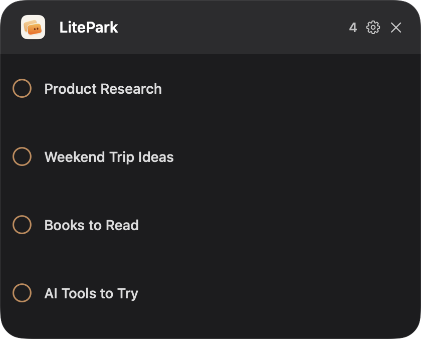

<p align="center">
  
</p>

<h1 align="center">LitePark</h1>

<p align="center"><strong>Park it now. Pick it up later.</strong></p>

<p align="center">A lightweight macOS companion for parking ChatGPT conversations you want to return to later.</p>

<p align="center">
  
</p>

## What is LitePark?

ChatGPT history is useful for finding old conversations, but it does not express a simple intention: “I cannot deal with this now, but I want to come back to it.” LitePark adds that small workflow to the ChatGPT desktop experience.

Use a global shortcut to park the conversation currently open in ChatGPT. A compact floating panel keeps the saved conversations in a manual queue until you open them again or mark them done.

## Features

- Add the current ChatGPT conversation with `⌃⌥L`
- Open or close the queue with `⌃⌥K`
- Reorder conversations by dragging the handle shown on row hover
- Open a saved conversation directly in ChatGPT Desktop
- Mark a conversation done to remove it from the queue
- Move the floating trigger anywhere on your displays
- Keep queue data locally on your Mac

## Requirements

- macOS 13 or later
- ChatGPT Desktop for macOS
- ChatGPT Desktop must be running while adding or opening conversations
- Accessibility permission for LitePark

LitePark uses macOS Accessibility to read the active conversation title and activate matching conversations in ChatGPT's visible sidebar. It does not read or store conversation contents.

## Installation

1. Download `LitePark-v1.0.1-macOS.zip` from the [v1.0.1 release](https://github.com/victor-zhang-2026/LitePark/releases/tag/v1.0.1).
2. Unzip it and move `LitePark.app` to Applications.
3. Right-click LitePark and choose **Open** the first time.
4. Grant Accessibility access when macOS asks. You can also enable it in **System Settings → Privacy & Security → Accessibility**.
5. Start ChatGPT Desktop before using LitePark.

The public build is not notarized with Apple. macOS may show an unidentified developer warning. Use right-click → **Open**, or choose **Open Anyway** in **System Settings → Privacy & Security** after the first blocked launch.

## Usage

1. Open a conversation in ChatGPT Desktop.
2. Press `⌃⌥L` to add it to LitePark.
3. Hover over or click the floating LitePark trigger to show the queue.
4. Click a conversation title to open it in ChatGPT.
5. Hover a row to reveal its drag handle, or use the circle on the left to mark it done.

## Known issues

### Conversation names

LitePark v1.0.0 identifies conversations by title. For the most reliable workflow:

1. Give the conversation a useful name in ChatGPT first.
2. Add it to LitePark.
3. Avoid renaming it in ChatGPT after adding it.

Different conversations with the same title are treated as ambiguous. This mechanism is planned for improvement in a future version, without a committed date.

### Sidebar visibility

Automatic reopening requires one exact matching conversation to be exposed in ChatGPT Desktop's current sidebar accessibility tree. LitePark keeps the item when it cannot safely identify one unique match.

## Privacy

LitePark stores only the metadata required for its local queue: a local item ID, conversation title, added time, and manual order. It stores no prompts, responses, account data, screenshots, analytics, or telemetry. Nothing is uploaded by LitePark.

All screenshots in this repository use fictional demo conversation names.

## Build from source

```bash
swift build -c release
./scripts/build-app.sh
```

The build script creates `.build/LitePark.app`. It uses the stable LitePark local signing identity when available and otherwise falls back to ad-hoc signing. Public distribution requires an appropriate Apple Developer signing and notarization setup for a warning-free first launch.

## Architecture

- SwiftUI queue interface with AppKit floating panels
- AXUIElement integration for ChatGPT title capture and sidebar navigation
- Carbon global shortcuts
- Codable JSON persistence in Application Support

## Feedback

Try LitePark, [report an issue](https://github.com/victor-zhang-2026/LitePark/issues), share what works or fails in your workflow, and star the repository if you find it useful.

## Acknowledgements

The floating window interaction follows implementation lessons from [LiteTick](https://github.com/victor-zhang-2026/LiteTick). Its MIT notice is preserved in [`Acknowledgements/LiteTick-LICENSE.txt`](Acknowledgements/LiteTick-LICENSE.txt).

## License

[MIT](LICENSE)
